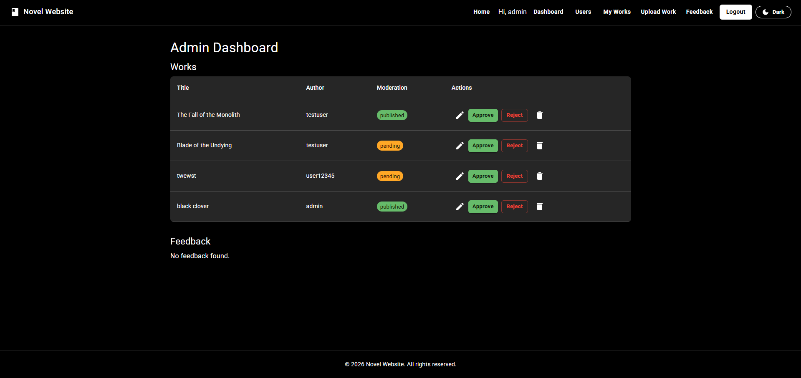
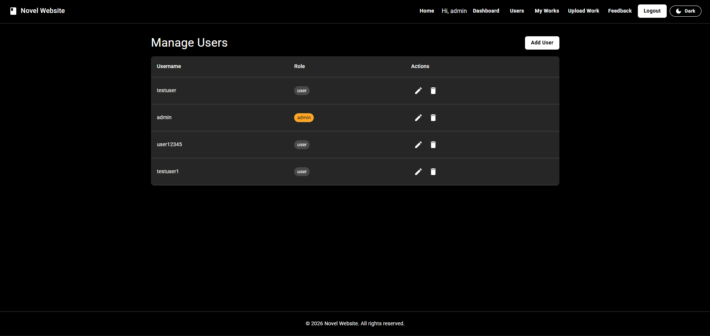
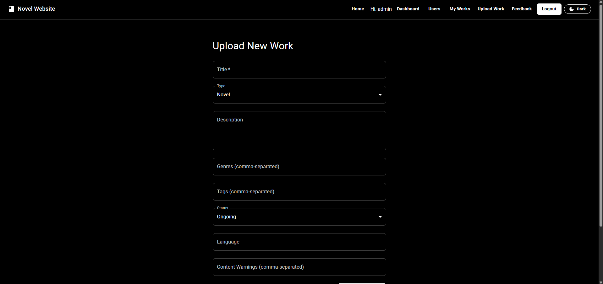
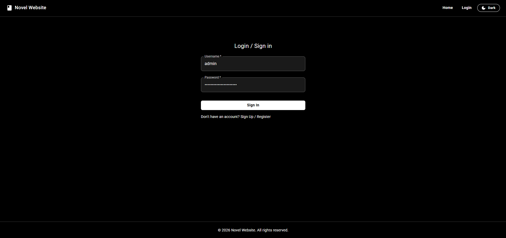
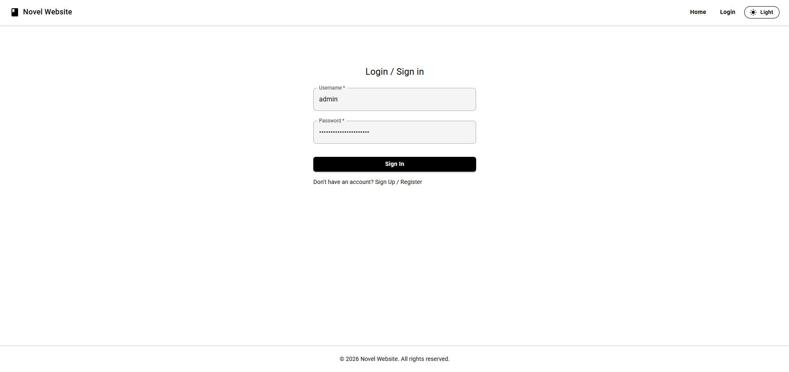
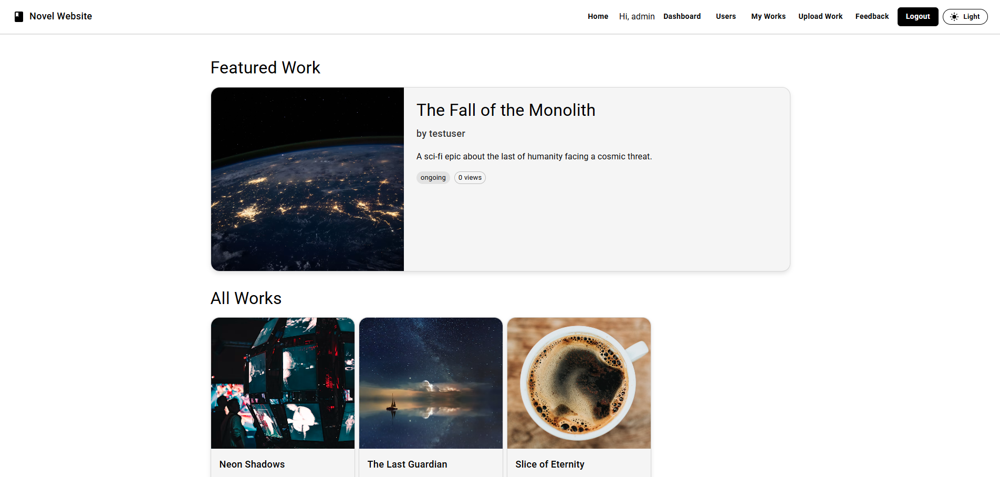

# Novel Website

A full-stack web application for authors to publish and manage their novels, and for readers to discover and enjoy stories. Built with a focus on security, performance, and high-quality visual presentation.

## Live Demo

**Link:** [https://digital-reading-websites.pages.dev/](https://digital-reading-websites.pages.dev/)

### Demo Credentials
Use these accounts to explore the platform:

| Role | Username | Password |
| :--- | :--- | :--- |
| **Regular User** | `testuser` | `password123` |
| **Administrator** | `admin` | `adminpassword` |

## Features

### Backend (API)
*   **Security First**: 
    *   CSRF protection using `csurf`.
    *   NoSQL injection sanitization.
    *   Secure security headers (Helmet-style).
    *   CORS configuration with origin validation.
    *   API rate limiting (General API, Auth, and File Uploads).
*   **Authentication & Authorization**:
    *   JWT-based authentication with secure HTTP-only cookie storage.
    *   Role-based access control (User, Admin).
    *   Secure password hashing with `bcryptjs`.
*   **Content Management**:
    *   CRUD operations for Works (novels, manga, comics) and Chapters.
    *   Cloudinary integration for secure image uploads (covers).
    *   Feedback system for user engagement.
*   **DevOps & Reliability**:
    *   Health check endpoint (`/api/health`).
    *   Database connection pooling and auto-reconnect.
    *   Comprehensive request logging.
    *   Type-safe development with TypeScript.

### Frontend (Client)
*   **Modern UI/UX**:
    *   Responsive design using **Material UI (MUI)**.
    *   **Dark/Light Mode** support with user preference persistence.
*   **Interactive Features**:
    *   Chapter reader with immersive reading experience.
    *   Author dashboard ("My Works") for content management.
    *   Admin dashboard for site and user management.
    *   Feedback submission and viewing.
*   **Smooth Navigation**:
    *   Declarative routing with **React Router 7**.
    *   Protected and Guest routes for secure access control.
    *   API integration with **Axios** and automated CSRF handling.

## Technologies Used

### Backend
*   **Framework**: Express.js (v5+)
*   **Runtime**: Node.js (v20+)
*   **Language**: TypeScript
*   **Database**: MongoDB (Mongoose ODM)
*   **File Storage**: Cloudinary (via Multer)
*   **Security**: jsonwebtoken, bcryptjs, csurf, express-rate-limit, cookie-parser

### Frontend
*   **Framework**: React 19
*   **Build Tool**: Vite
*   **Styling**: Material UI (MUI)
*   **Routing**: React Router 7
*   **Language**: TypeScript

## Setup and Installation

### Prerequisites
*   Node.js (LTS version)
*   npm or yarn
*   Git
*   MongoDB (Local or Atlas)
*   Cloudinary Account (for image uploads)

### 1. Clone the Repository
```bash
git clone https://github.com/your-username/novel-website.git
cd novel-website
```

### 2. Backend Setup
Navigate to the `backend` directory:
```bash
cd backend
npm install
```

Create a `.env` file in the `backend` directory:
```env
PORT=5000
MONGO_URI=your_mongodb_connection_string
MONGO_DB_NAME=novel-website
JWT_SECRET=your_jwt_secret
CORS_ORIGIN=http://localhost:5173
NODE_ENV=development

# Cloudinary Configuration
CLOUDINARY_CLOUD_NAME=your_cloud_name
CLOUDINARY_API_KEY=your_api_key
CLOUDINARY_API_SECRET=your_api_secret
```

### 3. Frontend Setup
Navigate to the `frontend` directory (from the project root):
```bash
cd ../frontend
npm install
```

Create a `.env` file in the `frontend` directory:
```env
VITE_API_URL=http://localhost:5000
```

## Running the Application

### Development Mode
**Backend:**
```bash
# From the backend directory
npm run dev
```

**Frontend:**
```bash
# From the frontend directory
npm run dev
```

### Production Build
**Backend:**
```bash
# From the backend directory
npm run build
npm start
```

**Frontend:**
```bash
# From the frontend directory
npm run build
npm run preview
```

## Available Scripts

### Backend
*   `npm run dev`: Starts the development server with auto-reload (using `tsx` and `nodemon`).
*   `npm run build`: Compiles TypeScript to JavaScript in `dist/`.
*   `npm start`: Runs the production server from `dist/`.
*   `npm run seed`: Resets and seeds the database with initial sample data.
*   `npm run works:images`: Updates existing works with high-quality placeholder images.
*   `npm run users:list`: Lists all registered users in the console.
*   `npm run users:password`: Changes a user's password via CLI.

### Frontend
*   `npm run dev`: Starts the Vite development server.
*   `npm run build`: Builds the application for production.
*   `npm run lint`: Runs ESLint for code quality checks.

## Screenshots

### Admin Dashboard


### User Management


### Add/Edit Work


### Login Page (Dark Mode)


### Login Page (Light Mode)


### Home Page


## Contributing
1.  Fork the project.
2.  Create your feature branch (`git checkout -b feature/AmazingFeature`).
3.  Commit your changes (`git commit -m 'Add some AmazingFeature'`).
4.  Push to the branch (`git push origin feature/AmazingFeature`).
5.  Open a Pull Request.

## License
Distributed under the ISC License.
